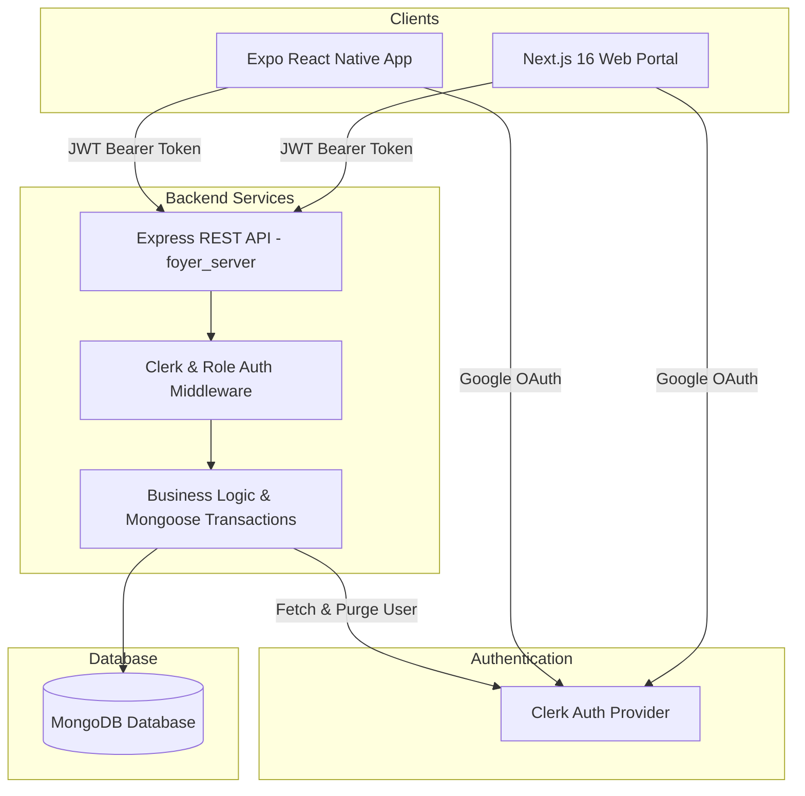
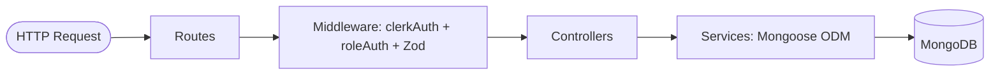
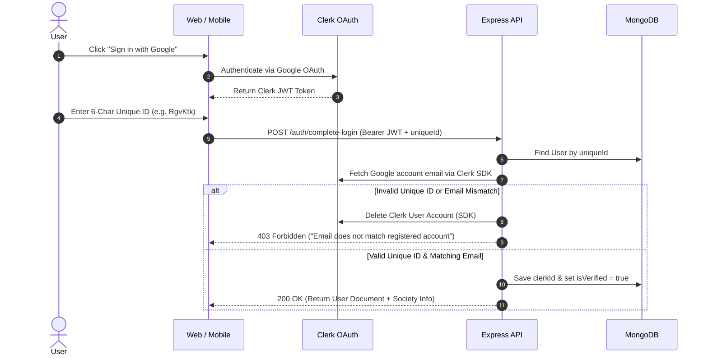

# 🏢 Foyer

> **A modern, enterprise-grade Society Management Platform designed to simplify residential community administration, structure hierarchy management, user governance, and security access control.**

---

## 📖 Overview

### What is Foyer?
**Foyer** is an enterprise-ready, multi-tenant residential society management ecosystem. It bridges administrative management with day-to-day community operations through a unified platform consisting of:
- **Express.js / MongoDB REST API** (`foyer_server`): The high-performance, transaction-safe core backend handling authorization, role governance, and structure logic.
- **Next.js 16 Web Governance Portal** (`foyer_web`): A feature-packed web application built for society owners and administrators to configure society structures, manage user roles, and monitor occupancy.
- **Expo Mobile Application** (`foyer_mobile`): A mobile app engineered for operational workflows, daily resident tasks, and guard access control.

### Why Foyer?
Managing modern gated communities and apartment complexes involves complex hierarchy management (towers, floors, flats), multi-role security permissions, and operational communication. Existing tools are often fragmented or lack strict authorization safeguards.

Foyer solves these challenges by providing:
1. **Automated Hierarchy Management**: Interactive tower generation and expansion with live flat numbering formulas (`floor * 100 + index`).
2. **Strict Structure Locks**: Architectural integrity safeguards that prevent deleting or modifying towers containing occupied residences.
3. **Secure Account Linking**: Google OAuth via Clerk tied to case-sensitive 6-character Unique IDs (`RgvKtk`), featuring automatic cleanup of mismatched Clerk user accounts.
4. **Role-Based Access Control (RBAC)**: Clear operational boundaries between Owners, Super Admins, Society Admins, Residents, and Security Guards.

---

## ✨ Features

### 🔐 Authentication & Account Verification
- **Google OAuth via Clerk**: Fast, secure sign-in powered by Clerk Auth SDK.
- **6-Character Case-Sensitive Unique ID Linking**: Pre-created users (Admins, Residents, Guards) link their Google accounts on first login using a unique 6-character code (e.g. `RgvKtk`).
- **Automatic Clerk Account Cleanup**: If a user attempts first-time sign-in with an invalid `uniqueId` or an email that does not match their pre-registered profile, the backend automatically purges the Clerk user record via Clerk SDK to keep authentication state clean.
- **Persistent JWT Interceptors**: Axios client on the frontend automatically attaches Clerk Bearer tokens to all API requests.

### 🏢 Society & Structure Management
- **Society Registration Wizard**: Bootstraps a new society along with its primary `owner` account.
- **Structure Generator**: Programmatically generates complex society layouts with configurable tower counts, floors per tower, and flats per floor.
- **Structure Expander**: Seamlessly appends new tower blocks to an existing society with sequential naming (`A, B, ... Z, A1, B1, ...`).
- **Interactive Hierarchy Tree View**: Visual tree representation of towers, floors, and flats with live status indicators (`Vacant` vs `Occupied`).
- **Extensible Structure Locks**: Restricts modifications or deletion of tower blocks if any flat within the tower is currently marked `occupied: true`.

### 👥 User Governance & Role Management
- **Tabbed User Portal**: Web dashboard displaying categorized tables with live counters for Super Admins, Admins & Owners, Residents, Security Guards, and All Users.
- **Multi-Role Support**: Schema support for multiple user roles (`User.roles: [String]`). Users assigned to a residence automatically receive the `resident` role alongside their administrative roles (e.g., `["admin", "resident"]`).
- **Owner Role Safeguards**: Server-side checks that strictly forbid creating or assigning the `owner` role through standard user creation endpoints.

### 🛡️ Security & Integrity
- **ACID Mongoose Transactions**: Multi-document operations (structure setup, expansion, and resident flat assignment) run inside MongoDB sessions with atomic rollback support.
- **Compound Unique Indexes**: Database-level protection preventing duplicate tower names, duplicate flat numbers per tower, or duplicate unique IDs per society.
- **Server-Side Role Authorization**: Fine-grained middleware checking permissions before executing controller logic.

### 🔮 Future Modules *(Planned)*
- **Visitor & Gate Pass Management**: Pre-approve guests, track delivery personnel, and verify entry/exit via QR code scanning.
- **Notice Board & Announcements**: Broadcast society updates with push notifications.
- **Complaints & Maintenance Ticketing**: Track service requests with status workflows.
- **Facility & Amenity Booking**: Reserve clubhouse, sports courts, and common spaces.

---

## 🛠️ Tech Stack

| Domain | Layer / Tool | Technology |
|---|---|---|
| **Backend** | Runtime & Framework | Node.js (>=20), Express.js |
| | Language | TypeScript |
| | ODM & Database | Mongoose 9, MongoDB Atlas |
| | Authentication | Clerk Express SDK (`@clerk/express`, `@clerk/backend`) |
| | Validation | Zod |
| | Build & Package Manager | `pnpm` (v11.9.0), `tsc`, `nodemon` |
| **Web Frontend** | Framework | Next.js 16 (App Router), React 19 |
| | Runtime & Package Manager | Bun |
| | Styling | Tailwind CSS v4, Radix UI Primitives, Lucide Icons |
| | State & Data Fetching | TanStack Query v5, Axios |
| | Forms & Toasts | React Hook Form, Zod, Sonner |
| **Mobile Client** | Framework | Expo (v55), React Native |
| | Navigation & Router | Expo Router, React Navigation |
| | Styling | Tailwind CSS v4, Uniwind, React Native Reanimated |
| | Hardware Features | Expo Camera, Notifications, Secure Store |

---

## 🏗️ Architecture



---

## ⚙️ Backend Architecture

The backend (`foyer_server`) follows a strict layered architecture designed for maintainability and data safety:



### Architectural Principles:
1. **Direct Mongoose ODM Service Layer**: Eliminated legacy repository abstraction wrappers. Controllers pass validated inputs directly to Service methods, which query Mongoose models.
2. **ACID Transactions**: Operations touching multiple collections (e.g. creating a tower and all associated floor flats, or assigning a resident to a flat while updating occupancy state) use `mongoose.startSession()` transactions.
3. **Zod Input Validation**: Request payloads are parsed and validated via Zod schemas in middleware before reaching controller logic.
4. **Compound Unique Indexes**:
   - `Tower`: `{ society: 1, name: 1 }` (unique)
   - `Flat`: `{ society: 1, tower: 1, flatNumber: 1 }` (unique)
   - `User`: `{ society: 1, uniqueId: 1 }` (unique)

---

## 💻 Frontend Architecture

The web dashboard (`foyer_web`) is structured using a **Feature-First Architecture** on Next.js 16:

```
foyer_web/src/
├── app/                        # Next.js App Router (Routes & Layouts)
│   ├── (auth)/                 # Public auth pages (Login)
│   ├── (dashboard)/            # Protected governance dashboard
│   │   ├── dashboard/          # Metrics overview
│   │   ├── society/            # Society profile details
│   │   ├── structure/          # Interactive tree & structure generator
│   │   ├── users/              # User management & role assignment tabs
│   │   └── profile/            # User account settings
│   ├── society/register/       # Onboarding wizard for new society owners
│   └── sso-callback/           # Clerk OAuth callback route
├── components/                 # Shared UI & Shell Components
│   ├── guards/                 # <AuthGuard> and <RoleGuard> HOCs
│   ├── layout/                 # AppShell, Sidebar, Header, Breadcrumbs
│   ├── shared/                 # DataTable, Status Badges, Spinners
│   └── ui/                     # Base primitives (Button, Input, Dialog, Select)
├── features/                   # Business Logic Modules
│   ├── auth/                   # LoginForm & auth state management
│   ├── society/                # RegisterSocietyForm & validators
│   ├── structure/              # StructureTreeView, Expander & Lock Dialogs
│   └── users/                  # UserTableTabs & CreateUser modals
├── hooks/                      # Custom hooks (e.g. useAuthUser)
├── providers/                  # QueryClient, Clerk, Theme, and Toast providers
└── services/api/               # Axios client configuration & endpoint functions
```

---

## 🔐 Authentication & Verification Flow

MongoDB serves as the **Single Source of Truth** for user profiles, roles, and society associations, while Clerk handles **Identity Provider OAuth**.



---

## 👤 User Roles & Operational Authority

### 1. Owner (`owner`)
- **Platform**: ✅ Web Portal | ❌ Mobile App
- **Responsibilities**:
  - Register new residential society and bootstrap owner profile.
  - Generate initial society structure (towers, floors, flats).
  - Expand existing society layout with new tower blocks.
  - Create and assign `Super Admin` accounts.
  - View master society analytics and settings.

### 2. Super Admin (`super_admin`)
- **Platform**: ✅ Web Portal | ❌ Mobile App
- **Responsibilities**:
  - Create and manage `Society Admin` accounts.
  - Create `Resident` and `Security Guard` accounts.
  - Monitor tower/flat occupancy and structure status.
  - Manage overall user governance and assignments.

### 3. Society Admin (`admin`)
- **Platform**: ✅ Web Portal | ✅ Mobile App *(Planned)*
- **Responsibilities**:
  - Onboard residents and security personnel.
  - Manage daily block operations and member records.
  - View society structure and occupancy statistics.

### 4. Resident (`resident`)
- **Platform**: ❌ Web Portal | ✅ Mobile App *(Planned)*
- **Responsibilities**:
  - View personal flat details and assigned family members.
  - Create gate passes for expected visitors *(Planned)*.
  - Submit complaints and view society announcements *(Planned)*.

### 5. Security Guard (`guard`)
- **Platform**: ❌ Web Portal | ✅ Mobile App *(Planned)*
- **Responsibilities**:
  - Verify visitor codes at entry gates *(Planned)*.
  - Log guest entry and exit times *(Planned)*.

---

## 📱 Platform Breakdown

| Role | Web Portal (`foyer_web`) | Mobile App (`foyer_mobile`) | Primary Usage Focus |
|---|:---:|:---:|---|
| **Owner** | ✅ | ❌ | Administrative onboarding, structure setup & executive control |
| **Super Admin** | ✅ | ❌ | Society-wide governance, user creation & oversight |
| **Society Admin** | ✅ | ✅ | Hybrid administrative oversight & block operations |
| **Resident** | ❌ | ✅ | Day-to-day resident self-service, gate passes & notices |
| **Guard** | ❌ | ✅ | Fast, gate-level access validation & visitor logging |

**Why this division?**
- **Web Portal** is optimized for high-density administrative workflows, multi-column data tables, tree layout visualization, and structure configuration wizards.
- **Mobile App** is optimized for quick actions, hardware integrations (Camera for QR scanning, Push Notifications), and on-the-go access for residents and gate guards.

---

## 📁 Monorepo Project Structure

```
foyer/
├── foyer_server/             # Express.js REST API
│   ├── src/
│   │   ├── config/          # Database & environment initialization
│   │   ├── controllers/     # HTTP endpoint handlers
│   │   ├── middleware/      # Authentication, Authorization, Validation
│   │   ├── models/          # Mongoose Schemas (User, Society, Tower, Flat)
│   │   ├── routes/          # Express route definitions
│   │   ├── services/        # Service layer & Mongoose transactions
│   │   └── utils/           # ID generator & naming utilities
│   ├── package.json
│   └── tsconfig.json
│
├── foyer_web/                # Next.js 16 Web Dashboard
│   ├── src/
│   │   ├── app/             # App Router pages and layout groups
│   │   ├── components/      # UI components, guards, layout shell
│   │   ├── features/        # Business logic modules (auth, society, structure, users)
│   │   ├── hooks/           # Custom React hooks
│   │   ├── providers/       # Theme, QueryClient, Toast, Clerk providers
│   │   ├── services/api/    # Axios client & API endpoints
│   │   └── types/           # TypeScript definitions
│   ├── .env.local
│   ├── README.md
│   └── package.json
│
└── foyer_mobile/             # Expo React Native Mobile App
    ├── src/                 # Mobile screen navigation & components
    ├── app.json             # Expo configuration
    ├── README.md
    └── package.json
```

---

## 🚀 Getting Started & Installation

### Prerequisites
- **Node.js**: `v20.0.0` or higher
- **Bun**: `v1.1.0` or higher (Recommended for `foyer_web`)
- **pnpm**: `v9.0.0` or higher (Recommended for `foyer_server`)
- **MongoDB**: Active local instance or MongoDB Atlas connection string
- **Clerk Account**: API credentials from [Clerk Dashboard](https://clerk.com)

---

### 1. Clone the Repository
```bash
git clone https://github.com/your-username/foyer.git
cd foyer
```

---

### 2. Backend Setup (`foyer_server`)

```bash
cd foyer_server

# Install dependencies using pnpm
pnpm install

# Create environment file
cp .env.example .env
```

Configure `.env` in `foyer_server`:
```env
PORT=8000
MONGO_URI=mongodb://localhost:27017/foyer
CLERK_PUBLISHABLE_KEY=pk_test_...
CLERK_SECRET_KEY=sk_test_...
```

Start dev server:
```bash
pnpm run dev
```
The server will start on `http://localhost:8000`.

---

### 3. Web Frontend Setup (`foyer_web`)

```bash
cd ../foyer_web

# Install dependencies using Bun
bun install

# Create environment file
cp .env.example .env.local
```

Configure `.env.local` in `foyer_web`:
```env
NEXT_PUBLIC_CLERK_PUBLISHABLE_KEY=pk_test_...
CLERK_SECRET_KEY=sk_test_...
NEXT_PUBLIC_API_URL=http://localhost:8000
```

Start dev server:
```bash
bun dev
```
The web portal will open at `http://localhost:3000`.

---

### 4. Mobile App Setup (`foyer_mobile`)

```bash
cd ../foyer_mobile

# Install dependencies
bun install

# Start Expo dev server
npx expo start
```

---

## 🔑 Environment Variables Reference

### Backend (`foyer_server/.env`)

| Variable | Description | Example |
|---|---|---|
| `PORT` | Port number for Express API server | `8000` |
| `MONGO_URI` | Connection URI for MongoDB instance / Atlas cluster | `mongodb://localhost:27017/foyer` |
| `CLERK_PUBLISHABLE_KEY` | Clerk Publishable API key used for JWT verification | `pk_test_Y2xhc3NpYy...` |
| `CLERK_SECRET_KEY` | Clerk Secret API key used for backend SDK actions (e.g. deleting users) | `sk_test_GTjcKY9y...` |

### Web Frontend (`foyer_web/.env.local`)

| Variable | Description | Example |
|---|---|---|
| `NEXT_PUBLIC_CLERK_PUBLISHABLE_KEY` | Public Clerk key for frontend sign-in components | `pk_test_Y2xhc3NpYy...` |
| `CLERK_SECRET_KEY` | Server-side Clerk key for Next.js SSR functions | `sk_test_GTjcKY9y...` |
| `NEXT_PUBLIC_API_URL` | Base HTTP endpoint URL for `foyer_server` backend | `http://localhost:8000` |

---

## 🌐 API Overview

| Method | Path | Required Auth | Allowed Roles | Description |
|---|---|:---:|---|---|
| `GET` | `/` | None | Public | Health check endpoint |
| `POST` | `/auth/complete-login` | Clerk JWT | Any User | Completes 1st-time code verification or standard login |
| `GET` | `/auth/me` | Clerk JWT | Any Linked User | Returns current user profile and society data |
| `POST` | `/society/register` | Clerk JWT | Bootstrap | Registers new society and initial `owner` account |
| `GET` | `/society/me` | Clerk JWT | Any Linked User | Returns society details for the authenticated user |
| `POST` | `/society/structure` | Clerk JWT | `owner`, `super_admin` | Generates initial tower and flat hierarchy |
| `POST` | `/society/structure/expand` | Clerk JWT | `owner`, `super_admin` | Expands structure with new tower blocks |
| `PATCH` | `/society/structure` | Clerk JWT | `owner`, `super_admin` | Bulk updates towers/flats (enforces Structure Lock) |
| `GET` | `/society/structure` | Clerk JWT | `owner`, `super_admin`, `admin` | Fetches complete society hierarchy tree |
| `POST` | `/user/super-admin` | Clerk JWT | `owner` | Creates a Super Admin account |
| `POST` | `/user/admin` | Clerk JWT | `super_admin` | Creates a Society Admin account |
| `POST` | `/user/resident` | Clerk JWT | `super_admin`, `admin` | Creates a Resident account & links to flat |
| `POST` | `/user/guard` | Clerk JWT | `super_admin`, `admin` | Creates a Security Guard account |

---

## 🔒 Security Architecture

1. **Strict Server-Side Role Enforcement**:
   - Middleware extracts the Clerk JWT, looks up the corresponding MongoDB user record, and checks `user.roles` against route requirements before proceeding.
2. **Owner Role Safeguard**:
   - `UserService.createUser()` explicitly rejects attempts to pass `owner` as a target role with a `403 Forbidden` response. The `owner` role can only be instantiated via `/society/register`.
3. **Clerk Account Cleanup on First Login**:
   - Prevents stale or unauthorized Clerk accounts from occupying space. If code validation fails, the backend triggers `clerkClient.users.deleteUser(clerkUserId)`.
4. **Structure Lock Safeguard**:
   - Before modifying or deleting any tower, `StructureService.checkStructureLock(towerId)` checks if any flat in that tower has `occupied: true`. If found, a `409 Conflict` error blocks the operation.
5. **ACID Transactions**:
   - All multi-document Mongoose operations run inside sessions to prevent partial state writes on database errors.

---

## 📊 Current Implementation Status

### ✅ Implemented
- [x] Express REST API core with TypeScript & Mongoose ODM.
- [x] Clerk OAuth authentication + 6-character Unique ID account linking.
- [x] Automatic cleanup of invalid Clerk user accounts.
- [x] Multi-tier role permissions (`owner`, `super_admin`, `admin`, `resident`, `guard`).
- [x] Society registration and bootstrap onboarding.
- [x] Dynamic structure generator and expander logic with formulas.
- [x] Structure Lock mechanism preventing edit/delete of occupied towers.
- [x] Compound unique database indexes across Tower, Flat, and User models.
- [x] Next.js 16 Web Governance Portal with feature-first layout.
- [x] Interactive Hierarchy Tree View with occupancy filter controls.
- [x] User management portal with tabbed views for all roles.
- [x] Centralized Axios client with Clerk JWT token injection.

### 🟡 In Progress
- [ ] Mobile App authentication flow integration with Clerk & backend.
- [ ] Mobile user dashboard for residents and guards.

### 🔮 Planned (Roadmap)
- [ ] Visitor Gate Pass Generation & QR Scanning.
- [ ] Digital Notice Board & Push Notifications.
- [ ] Complaint & Ticket Tracking System.
- [ ] Facility & Amenity Reservation.
- [ ] Society Maintenance Fee Payment Gateway Integration.

---

## 🤝 Contributing

Contributions to **Foyer** are welcome! Please follow these steps:
1. Fork the repository.
2. Create your feature branch (`git checkout -b feature/AmazingFeature`).
3. Commit your changes (`git commit -m 'Add some AmazingFeature'`).
4. Push to the branch (`git push origin feature/AmazingFeature`).
5. Open a Pull Request.

---

## 📜 License

This project is licensed under the **ISC License**. See the `package.json` files for details.

---

*Foyer Enterprise Platform © 2026. Designed and engineered for modern society management.*
