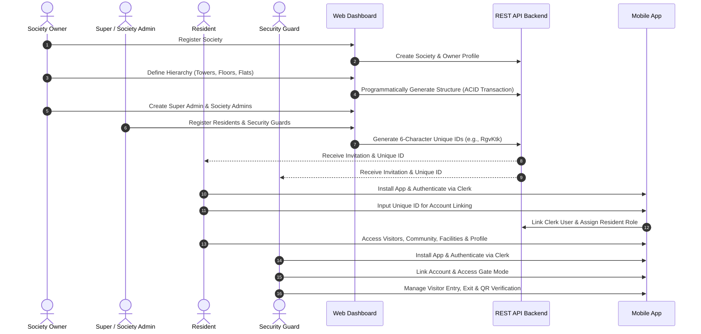
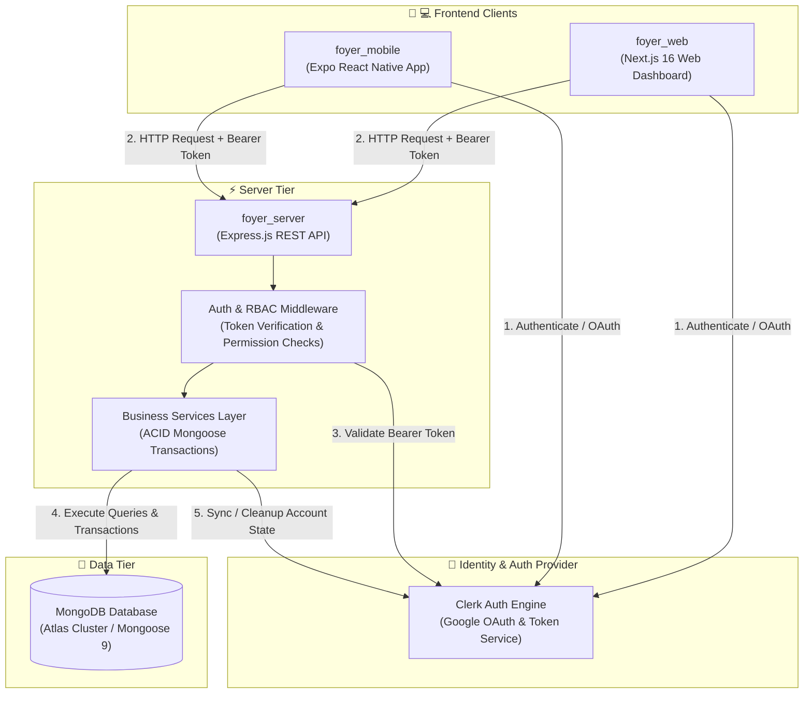

# 🏢 Foyer

> **A modern B2B SaaS Society Management Ecosystem empowering gated communities with digital administration, structural hierarchy management, multi-tier RBAC, and a seamless resident & guard mobile experience.**

<p align="center">
  
  
  
  
  
  
</p>

---

## 📖 1. About Foyer

### What is Foyer?
**Foyer** is an enterprise-grade **B2B SaaS Society Management Platform** designed for gated communities, apartment complexes, housing societies, and residential townships. It digitizes day-to-day administrative operations, security access workflows, resident engagements, and structural asset tracking into a unified digital ecosystem.

### Why Foyer?
Traditional residential management relies on fragmented communication tools, physical entry ledgers, and manual record-keeping. This creates security vulnerabilities, administrative delays, and lack of transparency.

Foyer solves these challenges by delivering:
- **Automated Structural Hierarchy**: Programmatically creates complex tower, floor, and flat structures with live flat-numbering rules (`floor * 100 + flatIndex`).
- **Occupancy Lock Safeguards**: Prevents destructive edits or deletion of towers/flats whenever residences are occupied.
- **Seamless & Secure Account Linking**: Integrates Google OAuth via Clerk tied to 6-character case-sensitive Unique IDs (`RgvKtk`) with automatic cleanup of invalid authentication attempts.
- **Granular Multi-Tier RBAC**: Enforces operational boundaries between Owners, Super Admins, Society Admins, Residents, and Security Guards.

### Who Uses Foyer?
- **Society Owners & Developers**: Bootstrap society setups and maintain high-level administrative governance.
- **Property Managers & Admins**: Oversee daily community operations, structure expansion, and user management.
- **Residents (Owners & Tenants)**: Manage household profiles, pre-approve guests, book amenities, and engage with the community.
- **Security Personnel**: Monitor gate checkpoints, record entry/exit traffic, and verify visitor QR codes.

---

## 🌐 2. Platform Overview

The Foyer ecosystem consists of three tightly coupled applications:

```
                      ┌────────────────────────────────────────┐
                      │              Clerk Auth                │
                      └──────────────────┬─────────────────────┘
                                         │
                   ┌─────────────────────┴─────────────────────┐
                   ▼                                           ▼
      ┌─────────────────────────┐                 ┌─────────────────────────┐
      │     Web Dashboard       │                 │   Mobile Application    │
      │       (Next.js)         │                 │         (Expo)          │
      │ Admin & Governance Hub  │                 │ Resident & Guard Portal │
      └────────────┬────────────┘                 └────────────┬────────────┘
                   │                                           │
                   └─────────────────────┬─────────────────────┘
                                         ▼
                      ┌────────────────────────────────────────┐
                      │            Backend REST API            │
                      │               (Express)                │
                      └──────────────────┬─────────────────────┘
                                         ▼
                      ┌────────────────────────────────────────┐
                      │            MongoDB Database            │
                      └────────────────────────────────────────┘
```

### 🧠 Backend REST API (`foyer_server`)
- **Purpose**: Central data processing engine, role governance, and security layer.
- **Responsibilities**:
  - Handles authentication validation and user role authorization.
  - Manages MongoDB Atlas operations with ACID session transactions.
  - Programmatically generates and expands society hierarchies.
  - Integrates Clerk SDK for user verification and orphaned account cleanup.

### 💻 Web Dashboard (`foyer_web`)
- **Purpose**: Administrative control panel for society management and structural governance.
- **Who Uses It**: Society Owners, Super Admins, and Society Admins.
- **Responsibilities**:
  - Interactive society bootstrap wizard and structure generator.
  - Visual hierarchy tree representation of towers, floors, and flats.
  - Comprehensive user management tables for admins, residents, and security staff.

### 📱 Mobile Application (`foyer_mobile`)
- **Purpose**: On-the-go operational tool for residents and security staff.
- **Who Uses It**: Residents and Security Guards.
- **Responsibilities**:
  - **Residents**: Manage profile settings, view structure details, pre-authorize visitors, and access community services.
  - **Security Guards**: Dedicated Gate Mode for visitor entry/exit logs, resident verification, and QR code scanning.

---

## 🔄 3. How Foyer Works

The business flow demonstrates how a society transitions from registration to operational management:



---

## 👤 4. User Roles

Foyer implements a multi-tier Role-Based Access Control (RBAC) model to ensure security and clear operational boundaries:

| Role | Scope | Key Responsibilities |
|---|---|---|
| **Society Owner** | Society Creator / Top Executive | Bootstraps society, configures structural parameters, provisions initial Super Admins, and holds master administrative access. |
| **Super Admin** | Platform / Executive Management | Manages multi-tower hierarchy, appends new towers, oversees platform operations, and provisions Society Admins. |
| **Society Admin** | Day-to-Day Operations | Onboards residents and guards, updates flat assignments, posts announcements, and manages local community requests. |
| **Resident** | Flat Occupant (Owner / Tenant) | Uses mobile app to manage flat profile, invite guests, book facilities, view announcements, and receive gate notifications. |
| **Security Guard** | Gate Checkpoint Staff | Uses mobile app in Gate Mode to verify incoming guests, log entry/exit timestamps, and scan digital QR passes. |

---

## 📁 5. Repository Structure

Foyer is organized as a monorepo containing three modular projects:

```text
foyer/
├── foyer_server/       # Node.js / Express.js REST API & Core Engine
├── foyer_web/          # Next.js 16 Administrative Web Dashboard
└── foyer_mobile/       # Expo (v55) / React Native Cross-Platform Mobile App
```

---

## 🏗️ 6. Project Structure

### ⚙️ Backend (`foyer_server`)
Follows a modular layered architecture with direct Mongoose ODM service integration and Zod input validation:

```text
foyer_server/src/
├── config/         # Environment variables and database connection setup
├── controllers/    # Express controllers parsing requests and invoking services
├── middleware/     # Auth (Clerk), RBAC authorization checks, and Zod validators
├── models/         # Mongoose schema definitions (Society, Tower, Flat, User)
├── routes/         # Express API endpoint definitions
├── services/       # Core business logic and ACID Mongoose transactions
├── types/          # TypeScript interface definitions
├── utils/          # Helper utilities (Unique ID generators, response builders)
└── validators/     # Zod schemas for strict request body validation
```

### 💻 Web (`foyer_web`)
Follows a feature-first Next.js 16 App Router architecture:

```text
foyer_web/src/
├── app/            # Next.js App Router pages and layout components
├── components/     # Reusable UI primitives and layout elements
├── constants/      # App constants, navigation links, and configuration
├── features/       # Feature modules (Society setup, Structure tree, User governance)
├── hooks/          # Custom React hooks
├── lib/            # Utility functions, Axios client, and Clerk configuration
├── providers/      # React context providers (QueryClientProvider, Auth, Theme)
├── services/       # API interaction layer for HTTP communication
└── types/          # TypeScript definitions for web state and API models
```

### 📱 Mobile (`foyer_mobile`)
Follows a feature-first Expo Router architecture with a design system engine:

```text
foyer_mobile/
├── assets/         # App icons, splash screens, and image assets
└── src/
    ├── app/        # Expo Router file-based screens and stack navigators
    ├── components/ # 19+ custom mobile UI primitives (Button, Card, Input, Sheet, etc.)
    ├── constants/  # API endpoints, storage keys, and app defaults
    ├── features/   # Mobile feature modules (Auth, Gate mode, Visitors, Community)
    ├── hooks/      # Custom mobile hooks (Theme, Auth, Device state)
    ├── lib/        # Storage helpers and utility functions
    ├── providers/  # Global providers (Auth, QueryClient, Theme)
    ├── store/      # Client-side state management
    └── theme/      # Centralized design system (Plus Jakarta Sans typography, light/dark themes)
```

---

## 🛠️ 7. Technology Stack

| Domain | Layer / Tool | Technology |
|---|---|---|
| **Backend** | Runtime & Framework | Node.js (>=20), Express.js |
| | Language | TypeScript |
| | ODM & Database | Mongoose 9, MongoDB Atlas |
| | Authentication | Clerk Express SDK (`@clerk/express`, `@clerk/backend`) |
| | Validation | Zod |
| | Build Tools | `pnpm`, `tsc`, `nodemon` |
| **Web Dashboard** | Framework | Next.js 16 (App Router), React 19 |
| | Runtime & Package Manager | Bun |
| | Styling & UI | Tailwind CSS v4, Radix UI Primitives, Lucide Icons |
| | State & Fetching | TanStack Query v5, Axios |
| | Forms & Toast | React Hook Form, Zod, Sonner |
| **Mobile Client** | Framework | Expo (v55), React Native |
| | Routing & Nav | Expo Router, React Navigation |
| | Styling & Motion | Tailwind CSS v4, Uniwind, React Native Reanimated |
| | Typography & Design | Plus Jakarta Sans, 19+ Custom UI Primitives |
| | Hardware Features | Expo Camera, Secure Store, Notifications |
| **Infrastructure** | Database | MongoDB Atlas |
| | Authentication | Clerk Auth Platform |
| | Deployment | Node Server (Backend), Vercel (Web), EAS / Expo (Mobile) |

---

## 🚀 8. Getting Started

### Prerequisites
- **Node.js**: `>= 20.0.0`
- **Package Managers**: `pnpm` (v11.9+) and `bun`
- **Database**: Local MongoDB instance or MongoDB Atlas URI
- **Authentication**: Clerk Account & API Keys

### 1. Clone the Repository
```bash
git clone https://github.com/ShubaBhardwaj/Foyer.git
cd foyer
```

### 2. Setup Backend (`foyer_server`)
```bash
cd foyer_server
pnpm install

# Create environment file
cp .env.example .env
```
Configure `.env`:
```env
PORT=5001
MONGODB_URI=mongodb+srv://<username>:<password>@cluster.mongodb.net/foyer
CLERK_PUBLISHABLE_KEY=pk_test_...
CLERK_SECRET_KEY=sk_test_...
```
Start development server:
```bash
pnpm dev
```

### 3. Setup Web Dashboard (`foyer_web`)
```bash
cd ../foyer_web
bun install
```
Configure `.env.local`:
```env
NEXT_PUBLIC_CLERK_PUBLISHABLE_KEY=pk_test_...
CLERK_SECRET_KEY=sk_test_...
NEXT_PUBLIC_API_URL=http://localhost:5001/api
```
Start web development server:
```bash
bun dev
```

### 4. Setup Mobile Application (`foyer_mobile`)
```bash
cd ../foyer_mobile
bun install
```
Configure `.env`:
```env
EXPO_PUBLIC_CLERK_PUBLISHABLE_KEY=pk_test_...
EXPO_PUBLIC_API_URL=http://<YOUR_LOCAL_IP>:5001/api
```
Start Expo development server:
```bash
bun start
```

---

## ⚡ 9. Current Features

| Feature Status | Capability Description |
|---|---|
| **✅ Implemented** | • **Google OAuth via Clerk**: Secure sign-in for Web and Mobile.<br>• **Account Linking**: 6-character Unique ID verification (`RgvKtk`) with auto-cleanup of invalid attempts.<br>• **Society Wizard**: Interactive society creation & administrative setup.<br>• **Structure Generator**: Programmatic multi-tower hierarchy generator (Towers → Floors → Flats).<br>• **Structure Expander**: Sequential tower expansion (`A, B... Z, A1`) with occupancy lock checks.<br>• **Visual Hierarchy Tree**: Live tree view with occupancy status tracking (`Vacant` / `Occupied`).<br>• **Multi-Tier RBAC**: Enforced permissions across 5 roles (Owner, Super Admin, Society Admin, Resident, Guard).<br>• **Mobile Design System Engine**: 19+ custom components powered by Plus Jakarta Sans typography and HSL themes. |
| **🚧 In Progress** | • Resident Visitor Pass pre-authorization & invitation generation.<br>• Security Guard Gate Mode QR code verification.<br>• Real-time push notification gateway for gate events. |
| **📅 Planned** | • Society Digital Notice Board & Broadcasts.<br>• Facility & Amenity Slot Reservations.<br>• Complaint & Maintenance Ticketing Workflows.<br>• Online Maintenance Fee Payment Integration. |

---

## 📐 10. Architecture Overview



---

## 🔮 11. Future Roadmap

- 🎫 **Visitor & Gate Management**: Digital gate passes, pre-approved entry codes, delivery tracking, and guard QR code scanning.
- 🏊 **Amenities & Bookings**: Slot reservation engine for clubhouses, sports courts, pools, and event halls.
- 🛠️ **Complaints & Maintenance**: Ticketing workflow for facility repairs, SLA tracking, and staff assignments.
- 📢 **Community Feed & Notices**: Digital notice board, polls, and emergency broadcasts.
- 💳 **Payments & Billing**: Automated maintenance bill generation, online payment integration, and transaction receipts.
- 📊 **Analytics & Reporting**: Occupancy insights, gate traffic metrics, and administrative audit logs.
- 🔔 **Real-Time Notifications**: Instant mobile push notifications for guest arrivals, gate approvals, and notice alerts.

---

## 🤝 12. Contributing

Contributions make the open-source community an amazing place to learn, inspire, and create. Any contributions you make are **greatly appreciated**.

1. Fork the Project
2. Create your Feature Branch (`git checkout -b feature/AmazingFeature`)
3. Commit your Changes (`git commit -m 'Add some AmazingFeature'`)
4. Push to the Branch (`git push origin feature/AmazingFeature`)
5. Open a Pull Request

---

## 📄 13. License

Distributed under the **MIT License**. See `LICENSE` for more information.
