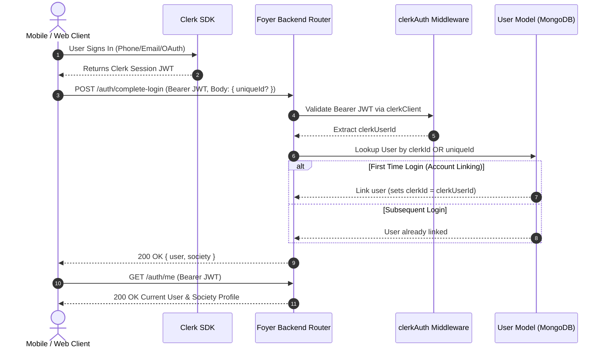

# FOYER_BACKEND_API_CONTRACT.md

# Foyer Society Management Platform — Backend Integration & API Contract Handbook

**Version:** 1.0.0  
**Author:** Senior Backend Architect & Technical Documentation Team  
**Scope:** `foyer_server` (`/Volumes/T7SSD/Developer/mobileDev/foyer/foyer_server`)  
**Target Audience:** Frontend Engineers (React Native / Mobile & Next.js / Web Admin), AI Coding Subagents, Integration Testers  

---

## 1. Executive Summary

### 1.1 Purpose of the Backend
The **Foyer Backend (`foyer_server`)** is an enterprise multi-tenant society management platform server providing secure, scalable RESTful micro-services for gated community management. It governs visitor access control, maintenance billing and invoice collection, complaint lifecycles, facility amenity bookings, community social streams, announcements, and executive analytical dashboards.

### 1.2 Technology Stack
- **Runtime:** Node.js (v18+) with TypeScript
- **Framework:** Express.js (`v4.19+`)
- **Database:** MongoDB via Mongoose ORM (`v8.4+`) with ACID Session Transactions
- **Authentication:** Clerk Identity Management (`@clerk/backend`)
- **Validation:** Zod Schema Validation (`v3.23+`)
- **Security:** Helmet (`v7.1+`), CORS, Fine-Grained Role-Based Access Control (RBAC)

### 1.3 Architecture Pattern
The backend enforces a strict **4-Layer Architecture**:
$$\text{Route (HTTP Endpoint)} \longrightarrow \text{Middleware (Auth/Role/Validation)} \longrightarrow \text{Controller (HTTP Adapter)} \longrightarrow \text{Service (Domain Logic)} \longrightarrow \text{Model (MongoDB)}$$

```
src/
├── config/             # DB connection, Env variables, Clerk client setup
├── constants/          # Enums, Permissions matrix, Status constants
├── controllers/        # Express handlers (Request parsing, status codes, Response mapping)
├── middleware/         # clerkAuth, roleAuth, requirePermission, validate, errorMiddleware
├── models/             # Mongoose schemas, interfaces, index definitions
├── routes/             # Express Router instances binding middleware to controllers
├── services/           # Pure domain logic, transaction session wrappers, integrations
├── types/              # Common TypeScript definitions & Search DTOs
├── utils/              # apiError, pagination, search.util, validation helpers
└── validators/         # Zod validation schemas for body, query, and params
```

### 1.4 Multi-Tenancy Architecture
Every database entity (Users, Visitors, Complaints, Amenities, Maintenance Cycles, Invoices, Notices, Posts) contains a mandatory `society` ObjectId reference.
Multi-tenant isolation is enforced at two levels:
1. **Request Scope:** `req.user.society` is extracted from the authenticated user's linked database document.
2. **Database Query Scope:** All service layer Mongoose queries automatically prepend `{ society: user.society }` to prevent cross-tenant data leakage.

---

## 2. Authentication Guide

### 2.1 Complete Authentication Flow



### 2.2 Token Management
- **Authorization Header:** `Authorization: Bearer <clerk_session_jwt>`
- **Token Verification:** Every protected route passes through `clerkAuth` middleware which executes `@clerk/backend` `clerkClient.authenticateRequest`.
- **Session Restore:** Client executes `GET /auth/me` on application launch. If token is valid and user is linked, backend returns the complete `User` document.

### 2.3 Auth Failure Cases
- `401 Unauthorized`: Missing `Authorization` header, invalid JWT key, or expired token.
- `401 Unauthorized`: User JWT is valid, but account is not linked to a society flat (returns `"Account not linked. Complete login first."`).
- `403 Forbidden`: Account status is set to `"blocked"`.

---

## 3. Permission System

### 3.1 Role Hierarchy & Permissions
Foyer implements a 5-tier role hierarchy:
$$\text{SUPER\_ADMIN} > \text{ADMIN} > \text{OWNER} \ge \text{RESIDENT} \ge \text{GUARD}$$

| Permission Symbol | Resident | Guard | Society Admin | Owner | Super Admin |
|:------------------|:--------:|:-----:|:-------------:|:-----:|:-----------:|
| `visitor:create` | ✅ | ✅ | ✅ | ✅ | ✅ |
| `visitor:read` | ✅ | ✅ | ✅ | ✅ | ✅ |
| `visitor:approve` | ✅ | ❌ | ✅ | ✅ | ✅ |
| `visitor:reject` | ✅ | ❌ | ✅ | ✅ | ✅ |
| `visitor:checkin` | ✅ | ✅ | ✅ | ✅ | ✅ |
| `visitor:checkout` | ✅ | ✅ | ✅ | ✅ | ✅ |
| `visitor:delete` | ✅ | ❌ | ✅ | ✅ | ✅ |
| `complaint:create` | ✅ | ❌ | ✅ | ✅ | ✅ |
| `complaint:read` | ✅ | ❌ | ✅ | ✅ | ✅ |
| `complaint:assign` | ❌ | ❌ | ✅ | ❌ | ✅ |
| `complaint:resolve` | ❌ | ❌ | ✅ | ❌ | ✅ |
| `complaint:delete` | ❌ | ❌ | ✅ | ❌ | ✅ |
| `notice:create` | ❌ | ❌ | ✅ | ❌ | ✅ |
| `notice:read` | ✅ | ✅ | ✅ | ✅ | ✅ |
| `notice:publish` | ❌ | ❌ | ✅ | ❌ | ✅ |
| `amenity:create` | ❌ | ❌ | ✅ | ❌ | ✅ |
| `amenity:read` | ✅ | ❌ | ✅ | ✅ | ✅ |
| `amenity:book` | ✅ | ❌ | ✅ | ✅ | ✅ |
| `amenity:approve` | ❌ | ❌ | ✅ | ❌ | ✅ |
| `maintenance:create` | ❌ | ❌ | ✅ | ❌ | ✅ |
| `maintenance:read` | ✅ | ❌ | ✅ | ✅ | ✅ |
| `maintenance:pay` | ✅ | ❌ | ✅ | ✅ | ✅ |
| `community:create` | ✅ | ❌ | ✅ | ✅ | ✅ |
| `community:read` | ✅ | ✅ | ✅ | ✅ | ✅ |
| `community:moderate`| ❌ | ❌ | ✅ | ❌ | ✅ |
| `dashboard:read` | ✅ | ✅ | ✅ | ✅ | ✅ |
| `analytics:read` | ❌ | ❌ | ✅ | ✅ | ✅ |

### 3.2 Authorization Pipeline
Routes are wrapped using stacked middleware:
```typescript
router.get(
  "/visitors",
  clerkAuth,                          // 1. Validates Clerk JWT
  requireLinkedAccount,               // 2. Ensures req.user exists
  requirePermission(Permission.VISITOR_READ), // 3. Evaluates Role-Permission matrix
  validate(listVisitorsSchema, "query"),       // 4. Validates request query schema
  visitorController.listVisitors      // 5. Controller invocation
);
```

---

## 4. API Standards

### 4.1 Response Wrapper Format
All responses adhere to standardized JSON payloads.

#### Success Response (Single Object)
```json
{
  "success": true,
  "data": { ... }
}
```

#### Success Response (Paginated Collection)
```json
{
  "success": true,
  "data": [ ... ],
  "meta": {
    "page": 1,
    "limit": 10,
    "total": 45,
    "totalItems": 45,
    "totalPages": 5,
    "hasNextPage": true,
    "hasPrevPage": false
  }
}
```

#### Standard Error Response
```json
{
  "success": false,
  "error": {
    "statusCode": 400,
    "message": "Invalid request input parameters",
    "details": [
      {
        "field": "phoneNumber",
        "message": "String must contain at least 10 character(s)"
      }
    ]
  }
}
```

### 4.2 Standard Parameters
- **Dates:** ISO-8601 UTC strings (`2026-07-26T10:00:00.000Z`)
- **IDs:** 24-character hex MongoDB ObjectIds (`66a2bc4e7d8e1234567890ab`)
- **Pagination Defaults:** `page=1`, `limit=10` (max limit: 100)

---

## 5. Endpoint Reference (By Module)

---

### 5.1 Authentication Module (`/auth`)

#### `POST /auth/complete-login`
- **Purpose:** Handles initial account linking and subsequent login session hydration.
- **Auth:** Clerk JWT Required (`clerkAuth`)
- **Permission:** None (Unlinked users allowed)
- **Request Body:**
  ```json
  {
    "uniqueId": "FOYER-RES-8821" // Optional on subsequent login, required on first login
  }
  ```
- **Success Response (200 OK):**
  ```json
  {
    "success": true,
    "data": {
      "user": {
        "_id": "66a2bc4e7d8e1234567890ab",
        "uniqueId": "FOYER-RES-8821",
        "clerkId": "user_2Pxxxxxx",
        "name": "Jane Doe",
        "email": "jane@example.com",
        "phone": "+919876543210",
        "roles": ["resident"],
        "society": "66a2bc4e7d8e123456789000",
        "tower": "66a2bc4e7d8e123456789001",
        "flat": "66a2bc4e7d8e123456789002",
        "isVerified": true,
        "status": "active"
      },
      "society": {
        "_id": "66a2bc4e7d8e123456789000",
        "name": "Grand Royale Palm",
        "societyCode": "GRP001"
      }
    }
  }
  ```
- **React Query Key:** `['auth', 'me']`
- **Frontend Hook:** `useCompleteLogin()`

#### `GET /auth/me`
- **Purpose:** Fetches currently authenticated user profile and society details.
- **Auth:** Clerk JWT + Linked Account
- **Success Response (200 OK):** Same user object as `complete-login`.

---

### 5.2 Society & Structure Module (`/society`)

#### `POST /society/register`
- **Purpose:** Public/Owner setup endpoint to register a new society and owner user.
- **Auth:** Clerk JWT Required
- **Request Body:**
  ```json
  {
    "name": "Emerald Heights",
    "address": "Sector 62, Gurgaon",
    "city": "Gurgaon",
    "state": "Haryana",
    "pincode": "122001",
    "ownerName": "John Smith",
    "ownerEmail": "john@emerald.com",
    "ownerPhone": "+919999988888"
  }
  ```
- **Success Response (201 Created):** Returns `{ society, owner }`

#### `POST /society/validate-code`
- **Purpose:** Public code validation check for onboarding.
- **Auth:** None (Public)
- **Request Body:** `{ "code": "GRP001" }`
- **Success Response (200 OK):** `{ "valid": true, "society": { "id": "...", "name": "..." } }`

#### `GET /society/me`
- **Purpose:** Fetches user's active society information.
- **Auth:** Clerk JWT + Linked Account

#### `POST /society/structure`
- **Purpose:** Generates bulk society structure (Towers and Flats).
- **Role Access:** `OWNER`, `SUPER_ADMIN`
- **Request Body:**
  ```json
  {
    "societyId": "66a2bc4e7d8e123456789000",
    "towers": [
      {
        "name": "Tower A",
        "totalFloors": 10,
        "flatsPerFloor": 4
      }
    ]
  }
  ```
- **Success Response (201 Created):** Returns generated structure tree.

#### `GET /society/structure`
- **Purpose:** Retrieves society towers and nested flats hierarchy.
- **Role Access:** `OWNER`, `SUPER_ADMIN`, `ADMIN`

---

### 5.3 User Management Module (`/user`)

#### `GET /user`
- **Purpose:** Lists users belonging to authenticated society.
- **Role Access:** `OWNER`, `SUPER_ADMIN`, `ADMIN`
- **Success Response (200 OK):** Array of `IUser` documents.

#### `POST /user/resident`
- **Purpose:** Registers a new resident flat assignment.
- **Role Access:** `SUPER_ADMIN`, `ADMIN`
- **Request Body:**
  ```json
  {
    "name": "Alice Johnson",
    "email": "alice@example.com",
    "phone": "+919811122233",
    "tower": "66a2bc4e7d8e123456789001",
    "flat": "66a2bc4e7d8e123456789002"
  }
  ```

#### `POST /user/guard`
- **Purpose:** Registers a security guard account.
- **Role Access:** `SUPER_ADMIN`, `ADMIN`

---

### 5.4 Visitor Management Module (`/visitors`)

#### `POST /visitors`
- **Purpose:** Creates a visitor pass request (Resident Pre-approval OR Guard Walk-in).
- **Permission:** `visitor:create`
- **Request Body:**
  ```json
  {
    "fullName": "Robert Bruce",
    "phoneNumber": "+919876543210",
    "visitorType": "guest", // "guest" | "delivery" | "cab" | "house_help" | "technician" | "other"
    "purpose": "Social Visit",
    "expectedArrival": "2026-07-26T14:00:00.000Z",
    "society": "66a2bc4e7d8e123456789000",
    "tower": "66a2bc4e7d8e123456789001",
    "flat": "66a2bc4e7d8e123456789002",
    "resident": "66a2bc4e7d8e1234567890ab",
    "vehicleNumber": "HR26DK1234"
  }
  ```
- **Business Rule:** If created by a resident, status auto-sets to `APPROVED`. If created by guard, status sets to `PENDING`.
- **Success Response (201 Created):** Returns `IVisitor` object with generated `entryCode` (6-character uppercase alphanumeric string).

#### `GET /visitors`
- **Purpose:** Query visitors list with filtering, search, and pagination.
- **Permission:** `visitor:read`
- **Query Parameters:** `page`, `limit`, `status`, `visitorType`, `tower`, `flat`, `resident`, `search`, `dateFrom`, `dateTo`
- **Success Response (200 OK):** Paginated result of visitors.

#### `POST /visitors/:id/approve`
- **Purpose:** Resident approves a pending visitor request.
- **Permission:** `visitor:approve`
- **Audit/Activity:** Publishes `VISITOR_APPROVED` to activity feed and audit trail.

#### `POST /visitors/:id/reject`
- **Purpose:** Resident rejects a visitor request.
- **Permission:** `visitor:reject`
- **Request Body:** `{ "statusRemark": "Not available at home" }`

#### `POST /visitors/:id/check-in`
- **Purpose:** Guard executes gate entry verification.
- **Permission:** `visitor:checkin`
- **Request Body:** `{ "entryCode": "A8X9L2" }` (Optional if `:id` provided)
- **Business Rule:** Requires visitor status to be `APPROVED`. Updates status to `CHECKED_IN`, sets `checkedInAt = Date.now()`, `checkedInBy = guardId`.

#### `POST /visitors/:id/check-out`
- **Purpose:** Guard executes gate exit check-out.
- **Permission:** `visitor:checkout`
- **Business Rule:** Updates status to `CHECKED_OUT`, sets `checkedOutAt = Date.now()`.

---

### 5.5 Complaint System Module (`/complaints`)

#### `POST /complaints`
- **Purpose:** Log a community complaint.
- **Permission:** `complaint:create`
- **Request Body:**
  ```json
  {
    "title": "Water Leakage in Main Bathroom",
    "description": "Seepage observed near ceiling connection.",
    "category": "PLUMBING", // PLUMBING, ELECTRICAL, CARPENTRY, SECURITY, CLEANLINESS, NOISE, PARKING, ELEVATOR, OTHER
    "priority": "HIGH", // LOW, MEDIUM, HIGH, URGENT
    "attachments": ["https://storage.foyer.com/uploads/leak1.jpg"]
  }
  ```

#### `GET /complaints`
- **Purpose:** List complaints with role isolation (Residents see own complaints, Admins see all).
- **Permission:** `complaint:read`

#### `POST /complaints/:id/assign`
- **Purpose:** Admin assigns complaint to a technician/staff member.
- **Permission:** `complaint:assign`
- **Request Body:** `{ "assignedTo": "66a2bc4e7d8e1234567890ff" }`

#### `POST /complaints/:id/resolve`
- **Purpose:** Mark complaint as resolved with mandatory notes.
- **Permission:** `complaint:resolve`
- **Request Body:** `{ "resolutionNotes": "Replaced valve fitting." }`

---

### 5.6 Amenity & Booking Module (`/amenities`, `/bookings`)

#### `POST /amenities`
- **Purpose:** Create society amenity facility.
- **Permission:** `amenity:create`
- **Request Body:**
  ```json
  {
    "name": "Clubhouse Badminton Court 1",
    "description": "Indoor wooden court",
    "capacity": 4,
    "operatingHoursStart": "06:00",
    "operatingHoursEnd": "22:00",
    "slotDurationMinutes": 60,
    "maxBookingsPerSlot": 1,
    "requiresApproval": false,
    "isPaid": true,
    "pricePerSlot": 200
  }
  ```

#### `POST /bookings`
- **Purpose:** Book an amenity slot.
- **Permission:** `amenity:book`
- **Request Body:**
  ```json
  {
    "amenity": "66a2bc4e7d8e1234567890aa",
    "bookingDate": "2026-07-28T00:00:00.000Z",
    "startTime": "07:00",
    "endTime": "08:00"
  }
  ```
- **Business Rule:** Concurrency protection validates overlapping bookings against `maxBookingsPerSlot` inside a MongoDB transaction session.

---

### 5.7 Maintenance & Billing Module (`/maintenances`, `/invoices`, `/payments`)

#### `POST /maintenances`
- **Purpose:** Admin creates a monthly maintenance billing cycle.
- **Permission:** `maintenance:create`

#### `POST /maintenances/:id/publish`
- **Purpose:** Publishes cycle and automatically generates flat invoices.
- **Permission:** `maintenance:publish`
- **Transaction:** Mongoose transaction creates `Invoice` documents for every active flat in society.

#### `GET /invoices`
- **Purpose:** Retrieve flat maintenance invoices.
- **Permission:** `maintenance:read`

#### `POST /payments`
- **Purpose:** Record maintenance invoice payment.
- **Permission:** `maintenance:pay`
- **Request Body:**
  ```json
  {
    "invoice": "66a2bc4e7d8e1234567890bb",
    "amount": 3500,
    "paymentMethod": "UPI", // CASH, UPI, BANK_TRANSFER, CHEQUE, ONLINE
    "transactionId": "UPI/129938812399/PAY"
  }
  ```

---

### 5.8 Community Stream Module (`/community`)

#### `POST /community/posts`
- **Purpose:** Publish community social post.
- **Permission:** `community:create`
- **Request Body:**
  ```json
  {
    "title": "Weekend Yoga Class",
    "content": "Join us at central park this Sunday at 7 AM.",
    "category": "EVENT",
    "attachments": ["https://storage.foyer.com/yoga.png"]
  }
  ```

#### `POST /community/posts/:id/comments`
- **Purpose:** Add comment or reply to post.
- **Permission:** `community:create`

#### `POST /community/reactions`
- **Purpose:** Toggle reaction on post or comment.
- **Permission:** `community:create`
- **Request Body:** `{ "targetType": "post", "targetId": "...", "reactionType": "LIKE" }`

---

### 5.9 Notice Board Module (`/notices`)

#### `POST /notices`
- **Purpose:** Create official society notice.
- **Permission:** `notice:create`

#### `POST /notices/:id/publish`
- **Purpose:** Publish notice to target audience (`RESIDENTS`, `OWNERS`, `GUARDS`, `ALL`).
- **Permission:** `notice:publish`

#### `POST /notices/:id/pin`
- **Purpose:** Pin notice to top of notice board.

---

### 5.10 Dashboard & Analytics Module (`/dashboard`)

#### `GET /dashboard/resident`
- **Purpose:** Fetches resident portal overview (Pending visitors, unpaid invoices count, active complaints, notices).

#### `GET /dashboard/guard`
- **Purpose:** Fetches guard gate control metrics (Today's expected visitors, active checked-in count, pending approvals).

#### `GET /dashboard/admin`
- **Purpose:** Fetches society admin executive metrics (Total residents, open complaints count, monthly collection sum, active maintenance cycle).

#### `GET /dashboard/analytics/complaints`
- **Purpose:** Aggregated analytics pipeline returning complaint counts grouped by category and status.

#### `GET /dashboard/analytics/visitors`
- **Purpose:** Aggregated analytics pipeline returning visitor traffic breakdown by type and peak arrival hours.

---

### 5.11 Notification Center Module (`/notifications`)

#### `GET /notifications`
- **Purpose:** List in-app notifications for authenticated user.
- **Query Params:** `unreadOnly=true`, `page`, `limit`

#### `POST /notifications/:id/read`
- **Purpose:** Mark notification as read.

#### `POST /notifications/read-all`
- **Purpose:** Mark all user notifications as read.

---

### 5.12 Upload System Module (`/uploads`)

#### `POST /uploads/image`
- **Purpose:** Upload image file (Multipart form-data field `file`).
- **Permission:** `file:upload`

#### `POST /uploads/document`
- **Purpose:** Upload document file (PDF/Doc).
- **Permission:** `file:upload`

#### `DELETE /uploads/:publicId(*)`
- **Purpose:** Delete file by public ID.
- **Permission:** `file:delete`

---

## 6. DTO Documentation & Schemas

### 6.1 User DTO
```typescript
interface IUserDTO {
  id: string;
  uniqueId: string;
  clerkId: string | null;
  name: string;
  email: string;
  phone: string;
  roles: ("owner" | "super_admin" | "admin" | "resident" | "guard")[];
  societyId: string;
  towerId: string | null;
  flatId: string | null;
  isVerified: boolean;
  status: "active" | "blocked";
}
```

### 6.2 Visitor DTO
```typescript
interface IVisitorDTO {
  id: string;
  fullName: string;
  phoneNumber: string;
  visitorType: "guest" | "delivery" | "cab" | "house_help" | "technician" | "other";
  purpose?: string;
  vehicleNumber?: string;
  expectedArrival: string;
  entryCode: string;
  status: "pending" | "approved" | "rejected" | "checked_in" | "checked_out" | "cancelled";
  checkedInAt?: string;
  checkedOutAt?: string;
}
```

---

## 7. Business Workflows

### 7.1 Visitor Approval & Entry Workflow
```
[Resident / Guard] ──> Create Pass (POST /visitors)
                           │
             ┌─────────────┴─────────────┐
      (Guard Walk-in)             (Resident Pre-Approval)
             │                           │
     Status = PENDING             Status = APPROVED
             │                           │
  [Resident Approves]                     │
(POST /visitors/:id/approve)              │
             │                           │
     Status = APPROVED <─────────────────┘
             │
      [Visitor Arrives]
   Guard Validates Code
(POST /visitors/:id/check-in)
             │
    Status = CHECKED_IN
             │
     [Visitor Departs]
(POST /visitors/:id/check-out)
             │
    Status = CHECKED_OUT
```

---

## 8. React Query Integration Guide

### 8.1 Key Matrix & Cache Invalidation

| Endpoint | React Query Key | Mutation Invalidate Keys |
|:---------|:----------------|:-------------------------|
| `GET /auth/me` | `['auth', 'me']` | N/A |
| `GET /visitors` | `['visitors', { status, page }]` | `['visitors']`, `['dashboard', 'resident']` |
| `POST /visitors` | N/A | `['visitors']`, `['dashboard']` |
| `POST /visitors/:id/approve` | N/A | `['visitors']`, `['visitor', id]` |
| `GET /complaints` | `['complaints', { status }]` | `['complaints']` |
| `POST /complaints` | N/A | `['complaints']`, `['dashboard']` |
| `GET /amenities` | `['amenities']` | `['amenities']` |
| `POST /bookings` | N/A | `['bookings']`, `['amenities']` |
| `GET /invoices` | `['invoices']` | `['invoices']` |
| `POST /payments` | N/A | `['invoices']`, `['payments']` |
| `GET /notices` | `['notices']` | `['notices']` |
| `GET /notifications` | `['notifications']` | `['notifications']` |

---

## 9. Role-Based UI Matrix

| Mobile / Web Screen | Resident | Guard | Admin | Owner |
|:--------------------|:--------:|:-----:|:-----:|:-----:|
| **Resident Dashboard** | ✅ Visible | ❌ Hidden | ❌ Hidden | ❌ Hidden |
| **Guard Gate Pass Screen** | ❌ Hidden | ✅ Visible | ❌ Hidden | ❌ Hidden |
| **Admin Dashboard** | ❌ Hidden | ❌ Hidden | ✅ Visible | ✅ Visible |
| **Pre-Approve Visitor Form** | ✅ CRUD | ❌ Hidden | ✅ CRUD | ✅ CRUD |
| **Gate Check-In Scanner** | ❌ Hidden | ✅ Exec | ✅ Exec | ❌ Hidden |
| **Create Complaint Screen** | ✅ CRUD | ❌ Hidden | ✅ Read-Only | ✅ Read-Only |
| **Resolve Complaint Action**| ❌ Hidden | ❌ Hidden | ✅ Exec | ❌ Hidden |
| **Amenity Booking Screen** | ✅ CRUD | ❌ Hidden | ✅ Admin | ✅ CRUD |
| **Publish Notice Form** | ❌ Hidden | ❌ Hidden | ✅ CRUD | ❌ Hidden |

---

## 10. Audit & Activity Logging Matrix

| Mutation Action | Service Method | Audit Action Symbol | Activity Type Symbol |
|:----------------|:---------------|:--------------------|:---------------------|
| Visitor Created | `VisitorService.createVisitor` | `VISITOR_CREATED` | `VISITOR_CREATED` |
| Visitor Approved | `VisitorService.approveVisitor` | `VISITOR_APPROVED` | `VISITOR_APPROVED` |
| Visitor Check-in | `VisitorService.checkInVisitor` | `VISITOR_CHECKED_IN` | `VISITOR_CHECKED_IN` |
| Complaint Resolved| `ComplaintService.resolveComplaint`| `COMPLAINT_RESOLVED` | `COMPLAINT_RESOLVED` |
| Notice Published | `NoticeService.publishNotice` | `NOTICE_PUBLISHED` | `NOTICE_PUBLISHED` |
| Maintenance Published | `MaintenanceService.publishMaintenance` | `MAINTENANCE_PUBLISHED` | `MAINTENANCE_PUBLISHED` |

---

## 11. Known Limitations & Unimplemented APIs

> [!WARNING]
> The following features do **NOT** exist in `foyer_server` implementation and must be handled appropriately by frontend UI (or marked as Disabled):

1. **Polls & Voting APIs (`NOT IMPLEMENTED`)**
   - Mongoose schema `poll.model.ts` exists, but there are **NO routes or controller endpoints** for listing polls or casting votes.
2. **Push Notifications Infrastructure (`STUB ONLY`)**
   - [notification.service.ts](file:///Volumes/T7SSD/Developer/mobileDev/foyer/foyer_server/src/services/notification.service.ts#L63) is a console logger placeholder. Expo/FCM push notifications are not delivered to mobile devices.
3. **Resident Vehicle Management (`NOT IMPLEMENTED`)**
   - Vehicle registration endpoints do not exist.
4. **Resident Family Members (`NOT IMPLEMENTED`)**
   - Family member profile assignment endpoints do not exist.
5. **User Profile Update (`NOT IMPLEMENTED`)**
   - `PATCH /user/me` endpoint is missing. Profile editing is currently read-only via `GET /auth/me`.
6. **Global Search API (`NOT IMPLEMENTED`)**
   - Unified `/search` route is missing. Searches must be performed against specific collection endpoints (`/visitors?search=...`, `/complaints?search=...`).

---

## 12. Frontend Development & Order Recommendation

### Integration Order Roadmap
1. **Auth & Identity Sync (`useCompleteLogin`, `useMe`)**
2. **Dashboard Hydration (`useResidentDashboard`, `useGuardDashboard`, `useAdminDashboard`)**
3. **Visitor Management Flow (Pre-approval, Approval, Gate Check-In/Check-Out)**
4. **Complaints Lifecycle (Create, Status Tracking, Resolution)**
5. **Amenities & Slot Booking**
6. **Notice Board & Community Stream**
7. **Maintenance Invoices & Payment Recording**
8. **In-App Notification Center**
9. **Media & Document Uploads**

---

## 13. Appendix & Constants Reference

### 13.1 Enums Reference

```typescript
export enum VisitorStatus {
  PENDING = "pending",
  APPROVED = "approved",
  REJECTED = "rejected",
  CHECKED_IN = "checked_in",
  CHECKED_OUT = "checked_out",
  CANCELLED = "cancelled",
}

export enum ComplaintStatus {
  OPEN = "OPEN",
  IN_PROGRESS = "IN_PROGRESS",
  RESOLVED = "RESOLVED",
  CLOSED = "CLOSED",
  REJECTED = "REJECTED",
}

export enum InvoiceStatus {
  UNPAID = "UNPAID",
  PARTIALLY_PAID = "PARTIALLY_PAID",
  PAID = "PAID",
  OVERDUE = "OVERDUE",
}

export enum PaymentMethod {
  CASH = "CASH",
  UPI = "UPI",
  BANK_TRANSFER = "BANK_TRANSFER",
  CHEQUE = "CHEQUE",
  ONLINE = "ONLINE",
}
```
